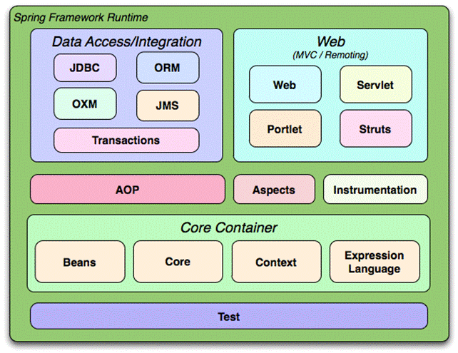

# Aula 1: Fundamentos

- O que é o Spring Framework
- Spring Versus Java EE
- Conceito de Inversão de Controle
- Injeção de Dependências
- Beans \ Autowired \ Scopes

## O que é o Spring Framework

O Spring Framework é um framework open source de desenvolvimento de software para a plataforma Java, oferecendo uma infraestrutura abrangente para facilitar a criação de aplicativos Java empresariais. É baseado nos padrões de projetos inversão de controle e injeção de dependências.

Sua estrutura é composta por módulos affins de reduzir a complexidade no desenvolvimento. Ele foi projetado para solucionar problemas comuns encontrados no desenvolvimento de aplicativos corporativos, como complexidade de configuração, acoplamento rígido e dificuldades de testabilidade. 



Em uma aplicação que utiliza o Spring Framework conta com diversas funcionalidades para facilitar a construção do projeto. 

Aqui será abordado o módulo **Core Container**, também chamado de **Ioc** (**Inversão de controle e injeção de dependências**).

## Core Container

O core container consiste de um dos módulos do Spring Framework que cuida das injeções de dependências e inversão de controle em um determinado projeto java. O container possui quatro módulos principais:

- **Beans** - Onde se encontram as classes básicas do framework que permitirão sua implementação no módulo beans.
- **Core** - onde são implementadas as classes mais básicas do framework.
- **Context** - onde são implementadas as classes mais avançadas.
- **Expression Language** - definem através de xml ou anotações em tempo de execução, valores e comportamentos dos beans.


Para utilizar o Spring Framework Core, é preciso ter esse container dentro da aplicação. Isso é feito na definição do projeto, colocando os arquivos .jar dentro do projeto.

**São eles**: 
- spring.core.3.1.1.RELEASE.jar 
- spring.beans.3.1.1.RELEASE.jar
- spring.context.3.1.1.RELEASE.jar 
- spring.expression.3.1.1.RELEASE.jar

Ao utilizar o **módulo Core Container** em uma aplicação, o programador passa para o `Spring` a responsabilidade de gerenciar todo o ciclo de vida do objeto de negócio, também denominado `bean`. Essa responsabilidade que é passada do programador para o Spring é denominada **Controle de Inversão**.

Ao instanciar e gerenciar os beans, o Spring já realiza a conexão com as dependências necessárias, ação essa que é chamada de **Injeção de Dependências do Spring**.

Para o Spring gerenciar esses beans, é preciso inicialmente o Spring conhecer qual a classe de origem desse objeto de negócio, ou seja, qual a classe responsável por sua implementação, aquela que atende aos requisitos funcionais da aplicação. Em seguida, é preciso configurar os valores e comportamentos desses beans que serão instanciados e gerenciados pelo Spring.

Essa configuração pode ser feita, em java, utilizando xml, anotações ou código java. Após o Spring conhecer essas configurações, o bean estará pronto para uso para o restante do sistema, como mostra a Figura 2 [2] abaixo.


## Spring vs. Java EE (Jakarta EE)

O cenário do Java empresarial foi significativamente moldado por dois grandes players: Java Enterprise Edition (Java EE) e Spring Framework.

Ambas as estruturas são essenciais no desenvolvimento de aplicativos corporativos robustos, escaláveis ​​e eficientes, mas abordam suas soluções com diferentes filosofias e arquiteturas.

Este guia abrangente tem como objetivo explorar as nuances do Java EE e do Spring, fornecendo uma comparação clara para ajudar desenvolvedores e profissionais de TI a tomar decisões informadas para seus projetos.


## 1. O que são?

### **Java EE (Jakarta EE)**
- **Java Enterprise Edition** (agora chamado de **Jakarta EE** após a transferência para a Eclipse Foundation).
- É um **framework de especificações** para o desenvolvimento de aplicações empresariais. Ele define uma série de APIs e padrões que facilitam o desenvolvimento de aplicações corporativas, como **serviços web**, **transações**, **injeção de dependências**, entre outros.
- Exemplos de tecnologias: **EJB (Enterprise JavaBeans)**, **JPA (Java Persistence API)**, **JMS (Java Message Service)**, **JSF (JavaServer Faces)**, **JAX-RS**.

### **Spring**
- Um **framework** de desenvolvimento para Java, focado em **agilidade** e **flexibilidade**. O Spring é uma **alternativa** ao Java EE, com o objetivo de simplificar o desenvolvimento de aplicativos corporativos.
- Oferece **integração** de diversas tecnologias e **abordagens simplificadas** para tarefas como **injeção de dependências** (DI), **programação orientada a aspectos** (AOP), **gestão de transações** e **acesso a dados**.
- Ao contrário do Java EE, o Spring não impõe uma abordagem específica, sendo mais **flexível** e **modular**.

---

## 2. Principais Diferenças

| **Aspecto**           | **Java EE (Jakarta EE)**                          | **Spring**                                         |
|-----------------------|---------------------------------------------------|---------------------------------------------------|
| **Arquitetura**        | Baseado em **especificações** e **containers** (ex: WildFly, GlassFish) | **Framework** modular e flexível, pode ser usado em qualquer container (como Tomcat, Jetty) |
| **Desenvolvimento**    | Mais **formal**, com especificações bem definidas. Pode ser mais **pesado** e complexo. | Mais **leve** e **flexível**, permitindo uma abordagem mais pragmática e ágil no desenvolvimento. |
| **Injeção de Dependência** | Usando **CDI (Contexts and Dependency Injection)**, mais rígido. | **Spring IoC (Inversion of Control)**, mais simples e intuitivo. |
| **Componentes**        | Requer uso de APIs **especificadas** pelo Java EE (ex: EJB, JMS, JSF). | Muito mais **modular**, permitindo o uso de componentes de forma independente (ex: Spring Boot, Spring Data). |
| **Facilidade de Uso**  | Tem uma curva de aprendizado maior devido à quantidade de conceitos e normas. | Mais **facilidade de configuração** e **flexibilidade**, principalmente com Spring Boot, que facilita a criação de microserviços. |
| **Gerenciamento de Transações** | Utiliza **JTA (Java Transaction API)**, pode ser mais complexo. | **Spring Transaction Management**, mais simples e flexível. |
| **Microservices**      | **MicroProfile** foi introduzido no Java EE para suporte a microserviços. | O **Spring Boot** é muito usado para **microserviços**, permitindo uma abordagem mais rápida e com menos configuração. |

---

## 3. Quando usar cada um?

### **Java EE (Jakarta EE)**:
- Ideal para empresas que já possuem um **grande legado** de sistemas Java EE e precisam de um **framework robusto** com **padrões de mercado**.
- Boa escolha quando a aplicação exige **compliance** com padrões e especificações empresariais (ex: EJBs, JPA).
  
### **Spring**:
- Melhor escolha para desenvolvedores que buscam **simplicidade**, **agilidade** e **flexibilidade** no desenvolvimento.
- Usado frequentemente em **microserviços**, **aplicações web**, e **backends modernos** devido à sua **integração rápida** com diferentes tecnologias.
- **Spring Boot** facilita a criação de **aplicações autônomas** e é especialmente popular em **ambientes de nuvem**.

---

## 4. Vantagens de Cada um

| **Spring**                                  | **Java EE (Jakarta EE)**                      |
|---------------------------------------------|-----------------------------------------------|
| **Flexível**, modular e fácil de configurar | **Especificações** bem definidas, ótimo para **grandes empresas** |
| Ideal para **microserviços** e **arquiteturas modernas** | **Conformidade** com padrões industriais       |
| Adoção crescente com **Spring Boot** para projetos rápidos e escaláveis | Boa escolha para aplicações **corporativas tradicionais** |
| **Mais comunidade** e **bibliotecas** para integração com outras tecnologias | **Suporte de longo prazo** e **estabilidade** no mercado |

---

## **Conclusão**:
- **Java EE (Jakarta EE)** é um conjunto de especificações com uma **estrutural rígida** e **pesada**, sendo uma escolha sólida para **grandes empresas** e sistemas corporativos.
- **Spring** oferece um **framework mais flexível**, com foco em **simplicidade** e **produtividade**. Ele é ideal para **microserviços**, **cloud-native applications** e **desenvolvimento ágil**.

Ambos têm seu valor, mas o **Spring** está se tornando a escolha preferida no desenvolvimento de aplicações **modernas** e **dinâmicas**, especialmente para quem busca **agilidade**.

---

## 🧠 Inversão de Controle (IoC)?

Trata-se do redirecionamento do fluxo de execução de um código retirando parcialmente o controle sobre ele e delegando-o para um container.

**Inversão de Controle** é um **princípio de design** da programação orientada a objetos onde a responsabilidade de **criar e gerenciar dependências** de um objeto **não é do próprio objeto**, mas de um **container externo**.

Em vez de uma classe criar suas próprias dependências (por exemplo, com `new`), ela recebe essas dependências de fora — geralmente por meio de um **framework**.

---

## 🎯 Objetivo

- **Desacoplar** as classes.
- Tornar o sistema mais **flexível**, **testável** e **fácil de manter**.

---

## 📦 Exemplo prático (sem IoC)

```java
public class Carro {
    private Motor motor;

    public Carro() {
        this.motor = new Motor(); // Carro cria o Motor — forte acoplamento
    }
}
```
> Neste exemplo, a classe `Carro` é responsável por instanciar o `Motor`. Se quisermos trocar o tipo de motor, teremos que mudar a `classe Carro`.`

## ✅ Exemplo com IoC (Inversão de Controle)

```java
public class Carro {
    private Motor motor;

    public Carro(Motor motor) {
        this.motor = motor; // Motor é "injetado" de fora
    }
}
```
> Agora, a responsabilidade de fornecer o `Motor` é de quem cria o `Carro`, não da `classe Carro`. Isso é Inversão de Controle.


## 💡 Como isso é feito na prática?
### Injeção de dependência
É um padrão de desenvolvimento com a finalidade de manter baixo o nível de acoplamento entre módulos de um sistema

Por meio de `Injeção de Dependência` (Dependency Injection), que é uma forma de implementar IoC. Um framework como o Spring pode fazer isso automaticamente:

```java
@Component
public class Carro {

    private final Motor motor;

    @Autowired
    public Carro(Motor motor) {
        this.motor = motor;
    }
}
```

> O Spring se encarrega de criar o `Motor` e injetá-lo no `Carro`

```java
public class Carro {
    private Motor motor;

    public Carro(Motor motor) {
        this.motor = motor; // Motor é "injetado" de fora
    }
}
```
> Agora, a responsabilidade de fornecer o `Motor` é de quem cria o `Carro`, não da `classe Carro`. Isso é Inversão de Controle.

## 📌 Benefícios
- **Desacoplamento** entre componentes

- Facilita **testes unitários** (usando `mocks`)

- Maior **reutilização** de código

- **Facilidade na manutenção** e evolução do sistema


## 💡 Beans
Objeto que é instanciado (criado), montado e gerenciado por um container através do principio da inversão de valores.


## 🧭 Scopes no Spring Framework

## 🔍 Scopes

**Scopes** definem o **tempo de vida** e **a visibilidade** de um **bean** no Spring. Em outras palavras, determinam quantas instâncias serão criadas e onde elas poderão ser acessadas.

---

## 📚 Escopos mais comuns no Spring

| Escopo         | Descrição                                                                 | Quando usar                                      |
|----------------|---------------------------------------------------------------------------|--------------------------------------------------|
| `singleton`    | (Padrão) Cria **uma única instância** para todo o container Spring        | Quando o bean é **stateless** (sem estado)       |
| `prototype`    | Cria **uma nova instância** a cada solicitação do bean                    | Quando você precisa de **novos objetos sempre**  |
| `request`      | Cria **uma instância por requisição HTTP** (web apps)                     | Para armazenar **dados da requisição**           |
| `session`      | Cria **uma instância por sessão HTTP**                                    | Para armazenar **dados de sessão do usuário**    |
| `application`  | Cria **uma instância por aplicação web**                                  | Para **dados compartilhados entre sessões**      |
| `websocket`    | Cria **uma instância por WebSocket**                                      | Para **comunicação em tempo real**               |

---

## 🔧 Como definir o escopo de um bean

```java
@Component
@Scope("prototype")
public class MeuBean {
    // Nova instância será criada a cada uso
}
```

> ℹ️ Se nenhum escopo for informado, o padrão é `singleton`.

## 🔁 Exemplo: Singleton vs Prototype

```java
@Component
public class ExemploSingleton {
    public ExemploSingleton() {
        System.out.println("Instância única criada.");
    }
}
```
```java
@Component
@Scope("prototype")
public class ExemploPrototype {
    public ExemploPrototype() {
        System.out.println("Nova instância criada.");
    }
}
```

- **ExemploSingleton**: mesma instância usada sempre.

- **ExemploPrototype**: nova instância criada a cada injeção.

### Dicas

É preferivel usar singleton sempre que possível (mais eficiente e simples).

Usamos prototype, request, session etc. apenas quando realmente necessário, especialmente em aplicações web com estados diferentes por usuário ou requisição.

## 🔧 `@Autowired` no Spring

A anotação `@Autowired` é usada no **Spring Framework** para realizar a **injeção automática de dependências**.

Uma anotação (indicação) onde deverá ocorrer uma injeção automática de dependênci.

- **byName** - É buscado um método `set` que corresponde ao nome do Bean.
- **byType** - É considerado o tipo de classe para inclusão do Bean.
- **byConstructor** - Usamos o construtor para incluir a dependência.
---

## ✅ O que faz?

- Injeta automaticamente um **bean** em outro bean gerenciado pelo Spring.
- Pode ser aplicada em:
  - **Construtores**
  - **Métodos**
  - **Atributos**

---

## 📌 Exemplo

```java
@Component
public class Servico {
    @Autowired
    private Repositorio repositorio;
}
```

### Dicas

- É recomendado usar @Autowired em construtores:

```java
@Component
public class Servico {
    private final Repositorio repositorio;

    @Autowired
    public Servico(Repositorio repositorio) {
        this.repositorio = repositorio;
    }
}
```

- Pode tornar a injeção opcional:
```java
@Autowired(required = false)
private OutraClasse opcional;
```
> Funciona melhor com componentes gerenciados (@Component, @Service, @Repository, etc).


