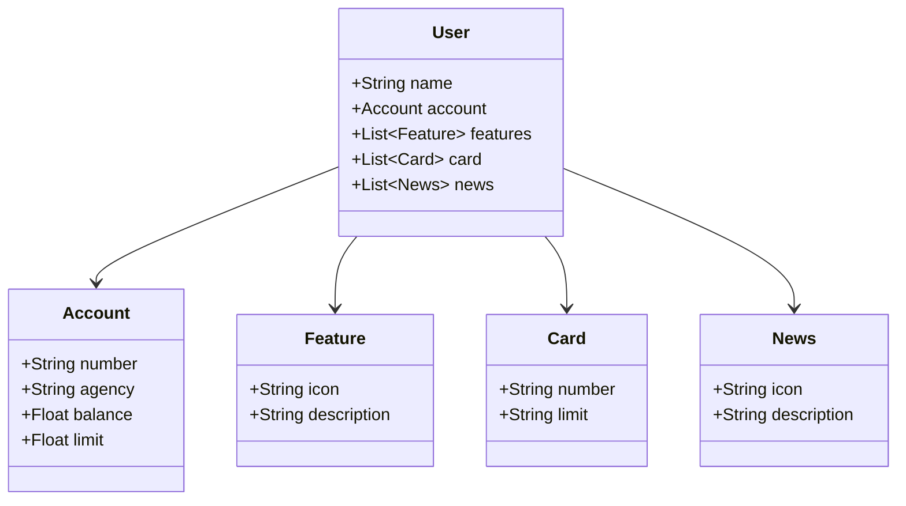

# Santander Dev Week

Java RESTful API 

## Diagrama de classes Mermaid

```mermaid
classDiagram

class User {
    +String name
    +Account account
    +List~Feature~ features
    +List~Card~ card
    +List~News~ news
}

class Account {
    +String number
    +String agency
    +Float balance
    +Float limit
}

class Feature {
    +String icon
    +String description
}

class Card {
    +String number
    +String limit
}

class News {
    +String icon
    +String description
}

User --> Account
User --> Feature
User --> Card
User --> News
```
