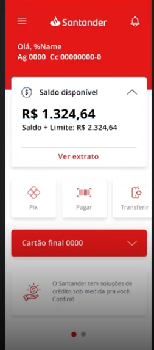

# Abstração inicial

## Informações da tela Santander do Figma



--------------------------------------
> Informações Usuário e conta
1. Nome
2. Agencia
3. Conta
--------------------------------------
> Informações financeiras
4. Saldo
5. Limite
6. Saldo + Limite
7. Extrato
--------------------------------------
> Informações com icones (icone + função)
8. Pix
9. Pagar
10. Transferir
--------------------------------------
> Novidades com icones (icone + notícia)
11. News

### JSON Inicial para tela proposta
```JSON
{
    "name": "Diego",
    "accountNumber": "00000000-0",
    "accountAgency": "0000",
    "accountBalance": 1324.64,
    "accountLimit": 1000.00,

    "pixIcon": "",
    "pixDescription": "PIX",
    "payIcon": "",
    "payDescription": "Pagar",
    "transferIcon": "",
    "transferDescription": "Transferir",

    "cardNumber": "xxxx xxxx xxxx 0000",
    "cardLimit": 1000.00,

    "newsIcon": "",
    "newsDescription": "O Santander tem soluções de crédito sob medida pra você."
}
```

### JSON após abstração inicial
```JSON
{
    "name": "Diego",
    "count":
    {
        "number": "00000000-0",
        "agency": "0000",
        "balance": 1324.64,
        "limit": 1000.00
    },   

    "features":
    [
        {
            "icon": "",
            "description": ""
        }
    ],

    "card":
    [
        {
            "number": "",
            "limit": ""
        }
    ],

    "news":
    [
        {
            "icon": "",
            "description": ""
        }
    ],
}
```